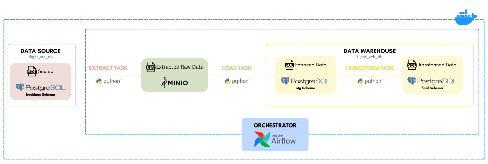
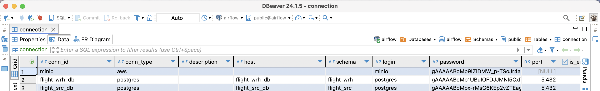
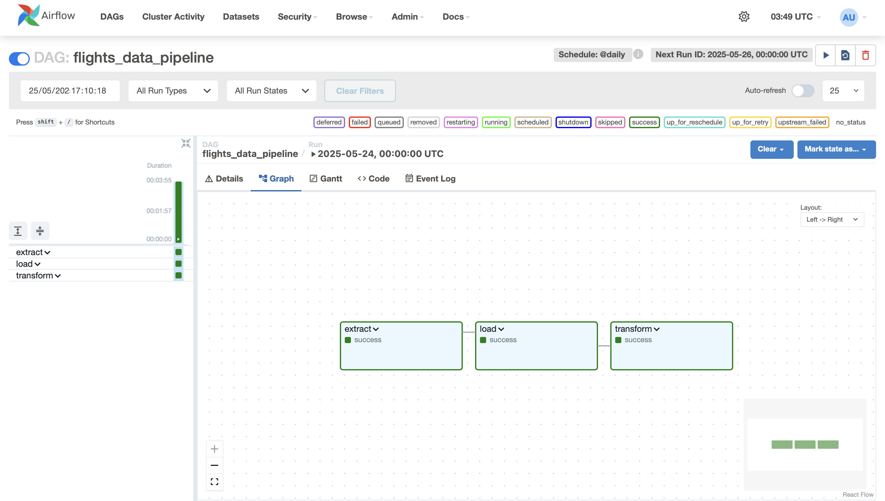
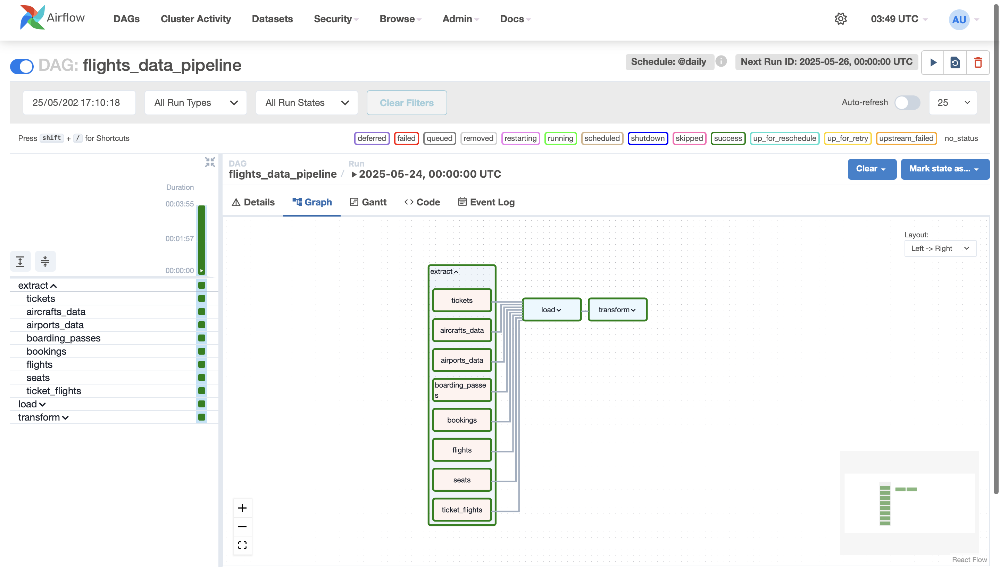
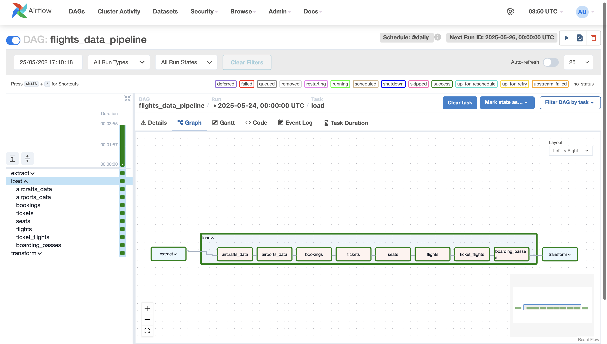
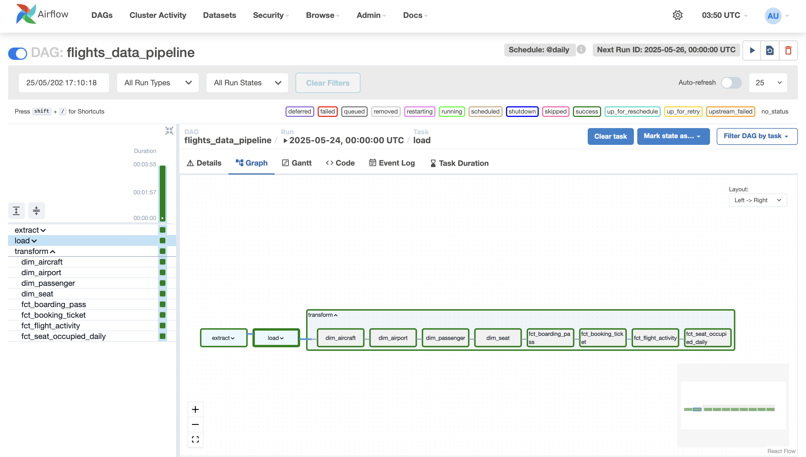

# Automated Data Pipeline Project

This project is designed to build an automated data pipeline that extracts data from a source database stores it temporarily in an object store, and loads it into a data warehouse. The pipeline will be orchestrated using Apache Airflow.

---
---

# Objective 

In this repository, I'll focus specifically on how I developed the ELT pipeline, including:

- Developing the ELT script

- Orchestrating and automating the pipeline with Apache Airflow

---

# Pipeline Workflow

Before diving into the main, take a look at the image below. This illustrates the workflow I followed to build this project.



- ## How The Pipeline Works

Pipeline ini menggunakan Apache Airflow untuk orkestrasi dan automisasi. Pipeline ini akan menggunakan skrip untuk membuat DAG yang berisi 3 task

- ### Extract Task
    The Extract task pulls raw data from the source database (flight_src_db) and saves it as CSV files. The output of this task is a set of CSV files containing raw data for each table from the source database and is stored in MinIO

- ### Load Task
    The Load task takes the extracted data (CSV files) and loads it into 'stg' schema in the warehouse database (flight_wrh_db). Stg schema will stores the raw data exactly as it came from the source database.

- ### Transform Task
    The Transform Task performs data transformations based on the design of the data warehouse.

    In this step, the raw data from the 'stg' schema is processed and transformed to match the structure and requirements of the data warehouse. Once transformed, the data is loaded into the final schema.

---

# Requirements

    - OS :
        - Linux
    
    - Tools :
        - Docker
        - MinIO
        - DBeaver (for PostgreSQL)
        - Apache Airflow
    
    - Programming Language
        - Python
        - SQL

    - Python Library:
        - pandas
        - pendulum
        - minio
        - cryptography

---


# Preparations

- ## Directory structure
    Set up the project directory structure to organize all project scripts. There is no strict rule where to put the folder and file. Still, make the directory understandable

    ```
    flight-data-pipeline/
    ├── dags/
    │   ├── flights_data_pipeline/
    │   │   ├── query/
    │   │   │   ├── aircrafts_data.sql
    │   │   │   ├── airports_data.sql
    │   │   │   ├── boarding_passes.sql
    │   │   │   ├── bookings.sql
    │   │   │   ├── flights.sql
    │   │   │   ├── seats.sql
    │   │   │   ├── ticket_flights.sql
    │   │   │   └── tickets.sql
    │   │   ├── run.py                     # Main DAG file
    │   │   └── tasks/
    │   │       ├── __init__.py
    │   │       ├── extract.py             # Extract logic
    │   │       ├── load.py                # Load logic
    │   │       └── transform/
    │   │           ├── dim_aircraft.sql
    │   │           ├── dim_airport.sql
    │   │           ├── dim_passenger.sql
    │   │           ├── dim_seat.sql
    │   │           ├── fct_boarding_pass.sql
    │   │           ├── fct_booking_ticket.sql
    │   │           ├── fct_flight_activity.sql
    │   │           └── fct_seat_occupied_daily.sql
    │   └── helper/
    │       ├── __init__.py
    │       ├── minio.py                  # MinIO client helper
    │       └── postgres.py               # Postgres helper
    ├── flight_src_db/
    │   └── init.sql                      # Source DB initialization SQL
    ├── flight_wrh_db/
    │   ├── init.sql                      # Warehouse DB initialization SQL
    │   └── stg_schema.sql                # Staging schema setup SQL
    ├── Dockerfile
    ├── docker-compose.yml
    ├── requirements.txt
    ├── README.md
    ├── .env
    ├── start.sh
    └── fernet.py                         # Optional, to encrypt the privacy data on connection in Apache Airflow
    ```

---

- ## Setup project environment

    Create and activate python environment to isolate project dependencies.

    ```
    python3 -m venv .venv
    source .venv/bin/activate
    ```

---

- ## Install requirements.txt

    Install the dependencies from _requirements.txt_ in the created environment.
  
    ```
    pip install -r requirements.txt
    ```

---

- ## Setup Database

    - [Source Database](flight_src_db/init.sql)
    - Warehouse Database
        - [Staging Schema](flight_wrh_db/stg_schema.sql)
        - [Final Schema](flight_wrh_db/init.sql)

- ## Create and Run a Docker Compose

    - Create [_docker_compose.yml_](docker-compose.yml) file to set up databases, minio, and apache airflow.
    Then store database credentials in [_.env_](.env) file  

    - Run the _docker-compose.yml_ file 
    
        ```
        docker compose up --build --detach
        ```

- ## Create _.env_ file
  - Create .env file to store all credential information.
  
  ```
  touch .env
  ```

  - Store database credentials in _.env_ file  

    
        - Airflow Metadata
        AIRFLOW_DB_USER=
        AIRFLOW_DB_PASSWORD=
        AIRFLOW_DB_NAME=
        AIRFLOW_FERNET_KEY=''
        AIRFLOW_DB_URI=postgresql+psycopg2://<username>:<password>@<host>:<port>/<database>
    
        - Source
        FLIGHT_SRC_DB_USER=
        FLIGHT_SRC_DB_PASSWORD=
        FLIGHT_SRC_DB_NAME=

        - Data Warehouse
        FLIGHT_WRH_DB_USER=
        FLIGHT_WRH_DB_PASSWORD=
        FLIGHT_WRH_DB_NAME=

        - MinIO
        MINIO_ROOT_USER=
        MINIO_ROOT_PASSWORD=
        

- ## Activate the container

    - Connect the database to DBeaver
        - Click **Database** > select **New Database Connection**

        - Select postgreSQL

        - Fill in the port, database, username, and password **as defined in your _.env_**

        - Click **Test Connection**

        - If no errors appear, the database connection is successful  
    
    - Check MinIO and Apache Airflow connection on localhost based on docker configuration. On this project is localhost:8081 and localhost:9001

- ## Make Connections on Apache Airflow
    - After you ensure that your Apache Airflow, MinIO, and databases are ready. Store the credentials and connections parameters of minIO and databases. This will make it easy
      to manage access to various external systems like MinIO and PostgreSQL (using DBeaver) across different tasks and workflows.
    - You can create connections on Apache Airflow UI:
          - Click *Admin*
          - Select *Connections*
          - Click *Add New Record*
          - Specified your connections
    - After make the connections, check *connection* table on database *airflow_metadata*. The illustration is below:
      
      

---
---

# ELT Scripts
    I developed each task separately to (what). All the task script is in [task](dags/flights_data_pipeline/tasks). This process will use Apache Airflow so we have to make script to run the DAG. But before that, I made separated moduls and folder (for transform) so it's easier to manage

  - ### [EXTRACT Task](dags/flights_data_pipeline/tasks/extract.py)
      
      - This task will extract data from the source PostgreSQL database and export it to MinIO as CSV files.
      - Source database is the bookings schema
      - Use Airflow’s PythonOperator to perform the extraction
      - Save each table’s data into a structured path in MinIO : /extracted-data/temp/<table_name>.csv.
      - Extraction tasks should run in parallel.

  - ### [LOAD Task](dags/flights_data_pipeline/tasks/load.py)
      
      - This task reads data from each CSV file generated by the Extract task and loads it into the staging schemas in the warehouse database.
      - Read the CSVs from MinIO using MinIO client.
      - Write the data into a staging schema (Upsert).
      - Use PythonOperator-based approach.
      - Load tables sequentially : aircrafts_data → airport_data → bookings → tickets → seats → flights → ticket_flights → boarding_passes
     
  - ### [TRANSFORM Task](dags/flights_data_pipeline/tasks/transform/)

      - This task executes Transform data from staging schema into dimension and fact tables in the data warehouse. For transformation task, I don't use transform.py.
      - For transform tasks that simply execute static SQL files with PostgresOperator and there is no complex Python logic that needs to be encapsulated into a function (unlike
        extract & load which accesses MinIO and upserts dataframes). PostgresOperator already executes the .sql file directly, so there is no need for Python wrapping., it is not
        necessary to create transform.py as a module.
      - Each SQL file (already provided) will transform staging data into cleaned and structured tables. Get transformations query here. Output tables are stored in the warehouse
        schema, and follow naming conventions: dim_airport, dim_seat, dim_passenger, fct_booking_ticket, fct_flight_activity, etc.
      - Make sure transformations are executed in the correct sequence to respect dependencies
---
---
# Run The Pipeline
To run the pipeline, create [the script](dags/flights_data_pipeline/run.py) that will wrap all the orchestration. Here is the DAG detail:
```
DAG ID	 : flights_data_pipeline
Schedule	 : Daily
Start date	 : Now
Catchup 	 : False
```

After that, access apache airflow on localhost:[apache_port] and run the dag _flights_data_pipeline_. Below are the illustrations if all tasks run smoothly.





---
---
# Conclusion

Well, you’ve reached the end of this report. 

I hope you’ve gained valuable insights that will help you in your own data engineering journey. If you have any questions or need additional information, feel free to reach out. I’m open to any feedback or suggestions you may have.

**You can read more project on:** 

- [My Medium](https://medium.com/@fajariana.tm)

    
  
